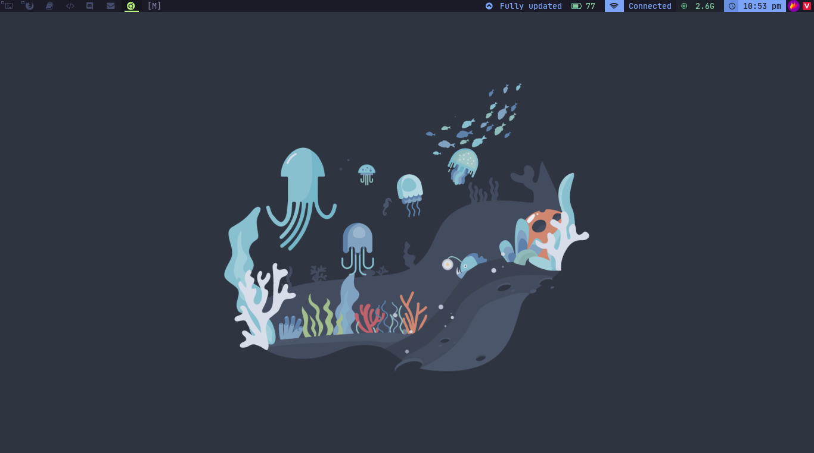

dwm - dynamic window manager
============================
dwm is an extremely fast, small, and dynamic window manager for X.

Requirements
------------
In order to build dwm you need the Xlib header files.

Installation
------------
Edit config.mk to match your local setup (dwm is installed into
the /usr/local namespace by default).

Afterwards enter the following command to build and install dwm (if
necessary as root):
    
    sudo make clean install

Screenshot
-------------
